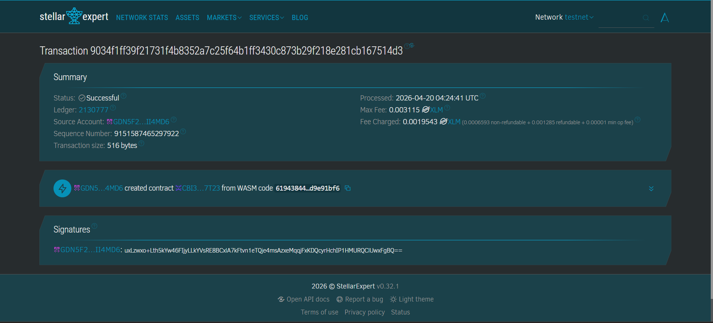

**Digital Certificate Registry** - A Web3 Application for Issuing and Verifying Student Credentials on the Stellar Blockchain.

## Project Description

The Digital Certificate Registry is a decentralized application built on the Stellar blockchain using the Soroban Smart Contract SDK and Rust. It provides educational institutions, bootcamps, and organizations with a secure, transparent, and tamper-proof method to issue digital certificates.

Instead of relying on centralized databases that can be altered or lost, this smart contract stores immutable certificate records directly on the blockchain. Anyone (e.g., employers) can verify the authenticity of a certificate using its unique ID.

## Key Features

1. **Issue Certificates (`register_certificate`)**: Organizations can register a student's name and course name. The system generates a unique pseudorandom ID and records the timestamp of issuance on the chain.
2. **View All Certificates (`get_certificates`)**: Anyone can query the contract to retrieve a list of all issued certificates.
3. **Verify Authenticity (`verify_certificate`)**: Quickly check if a specific certificate ID exists in the blockchain registry.

## Contract Details

- **Testnet Contract ID**: `CBI3FDRAS7HCF6DWUYMTLELFWQKQAHV4SLCOLQYZNXQDSZSMJVK57T23`
- **Network**: Stellar Testnet

### Screenshot

---

### Set Up Freighter Wallet

1. Install the [Freighter Wallet](https://www.freighter.app/) browser extension.
2. Open Freighter, create or restore a wallet.
3. Go to `Settings` (the gear icon) > `Preferences` > enable **Testnet** mode.
4. Fund your testnet account by using the [Stellar Laboratory Friendbot](https://laboratory.stellar.org/#account-creator?network=test). Simply paste your public key to get free test XLM.

### Deploy using Stellar Laboratory

1. Go to [Stellar Laboratory](https://laboratory.stellar.org/).
2. On the top right, ensure the network is set to **Testnet**.
3. Under the tools menu, select **Deploy Smart Contract**.
4. Click **Connect Freighter** to link your funded wallet.
5. Upload your newly built `certificate_registry.wasm` file (from the `target/release/` folder).
6. Click **Upload to Network**. Verify and sign the transaction with your Freighter wallet.
7. Wait for the transaction to succeed. The Laboratory will display your **Contract ID**.

### Interact with the Smart Contract

Once deployed, you can use the **Interact** section in Stellar Laboratory:
1. Copy the **Contract ID** you received.
2. Paste it into the "Contract Address" field.
3. Call the `register_certificate` function by providing a `student_name` (e.g., "John Doe") and a `course_name` (e.g., "Web3 Soroban Bootcamp"). Sign the transaction with Freighter.
4. Call the `verify_certificate` function with the returned ID to confirm it is valid!

---
*Built for the Stellar ecosystem.*
